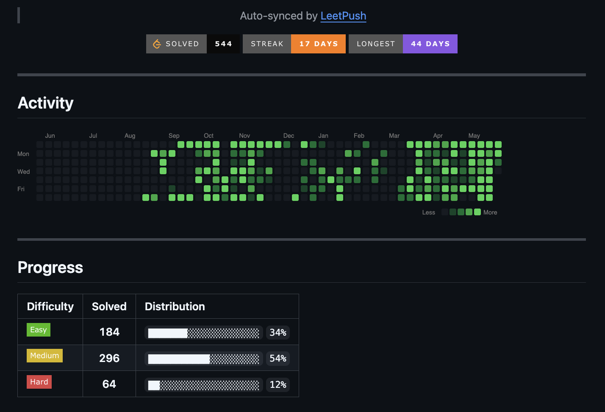
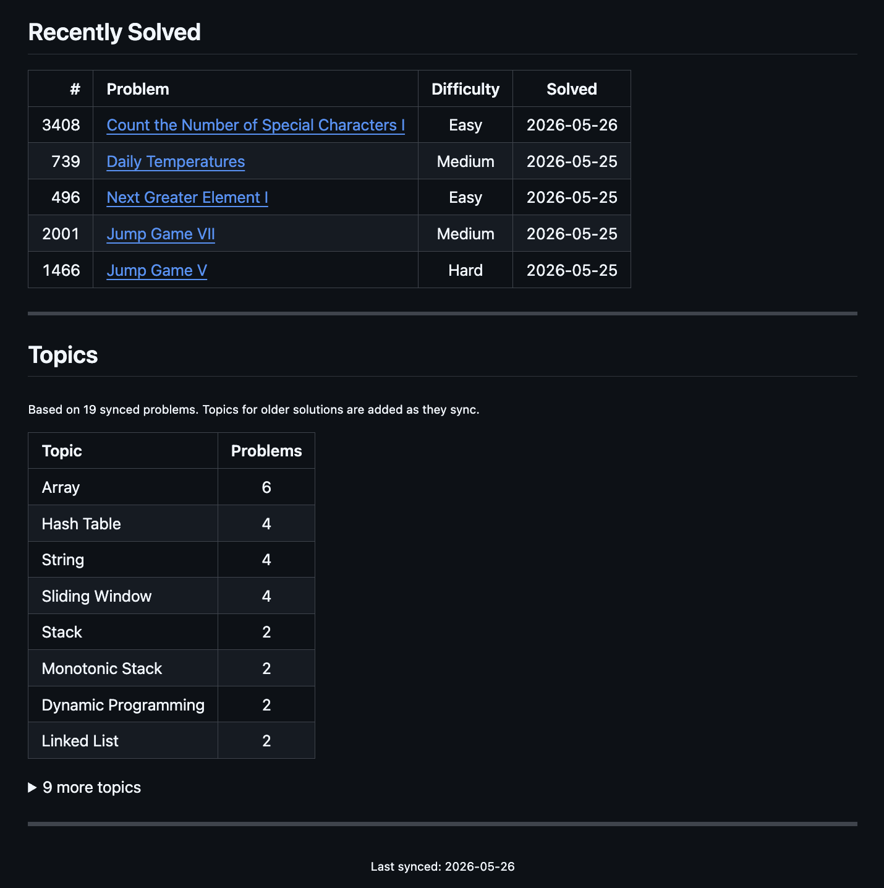
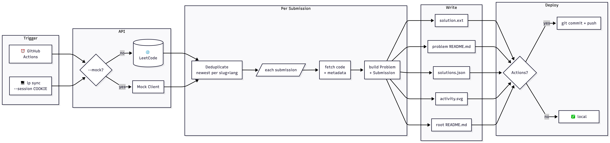

<div align="center">

# LeetPush

**Auto-sync your LeetCode solutions to GitHub, beautifully.**

[](LICENSE)
[](https://python.org)

</div>

---

LeetPush is a GitHub Action (plus CLI) that pulls your accepted LeetCode submissions every day and commits them to a dedicated solutions repo, with a structured folder layout, per-problem READMEs, a live activity heatmap, and progress badges.

**See it live:** [sahu-adarsh/leetcode-solutions](https://github.com/sahu-adarsh/leetcode-solutions)

<!-- Screenshot 1: top of the generated README (badges + heatmap + progress table) -->

<p align="center"><sub>Activity heatmap and difficulty breakdown</sub></p>

<!-- Screenshot 2: full README view (recently solved + topics) -->

<p align="center"><sub>Recently solved problems and topic distribution</sub></p>

---

## How it works

<div align="center">



</div>

---

## Quick Start (5 minutes)

### Step 1: Create a solutions repo on GitHub

Go to [github.com/new](https://github.com/new) and create a **public** repository (e.g. `leetcode-solutions`). Leave it empty; do not initialize with a README.

### Step 2: Add your LeetCode session as a secret

You need to give LeetPush read-only access to your submissions.

1. Get your session cookie — [see instructions below](#getting-your-leetcode-session-cookie)
2. In your new repo, go to **Settings → Secrets and variables → Actions → New repository secret**
3. Name: `LEETCODE_SESSION` and paste the cookie value

### Step 3: Scaffold the repo locally

Install LeetPush and run `lp init` inside a local clone of your new repo:

```bash
# Install
pip install leetpush

# Clone your new empty repo
git clone https://github.com/<you>/leetcode-solutions
cd leetcode-solutions

# Scaffold
lp init --username <your-leetcode-username>
```

This creates:

```
.github/workflows/sync.yml   <- daily Action that syncs your solutions
.leetpush.yml                <- your config
solutions.json               <- local index (source of truth)
```

### Step 4: Do a local sync first (recommended)

Populate your repo before the first Action run so you get an immediate result:

```bash
export LEETCODE_SESSION="<your-session-cookie>"
lp sync --username <your-leetcode-username>
```

You should see your solutions appear under `solutions/`.

### Step 5: Push to GitHub

```bash
git add -A
git commit -m "init: leetpush scaffold"
git remote add origin https://github.com/<you>/leetcode-solutions.git
git push -u origin main
```

The Action will now run **daily at 02:00 UTC**. To trigger it immediately:

> GitHub repo → **Actions** → **Sync LeetCode Solutions** → **Run workflow**

That's it. Every accepted submission from here on will be committed automatically.

---

## Getting Your LeetCode Session Cookie

LeetPush reads your submissions through the same session LeetCode uses in your browser. It never stores your password.

1. Log in to [leetcode.com](https://leetcode.com) in Chrome or Firefox
2. Open **DevTools** → **Application** (Chrome) or **Storage** (Firefox)
3. Navigate to **Cookies → https://leetcode.com**
4. Find the cookie named **`LEETCODE_SESSION`** and copy its **Value**

> Session cookies typically last 30 days. If the Action stops committing new solutions, grab a fresh cookie from your browser and update the secret.

---

## What You Get

After syncing, your solutions repo will have:

**Root `README.md`** auto-generated with:
- Solved count, current streak, and longest streak badges
- Activity heatmap showing your full submission history
- Difficulty breakdown with visual progress bars
- Last 5 recently solved problems
- Topic distribution table

**Per-problem `README.md`** inside each solution folder:
- Problem title, difficulty, topics, and link to LeetCode
- Table of solutions across languages with runtime and memory stats
- Editable Approach and Complexity sections, LeetPush never overwrites your notes

---

<div align="center"><sub>Built by <a href="https://github.com/sahu-adarsh">Adarsh Sahu</a></sub></div>
